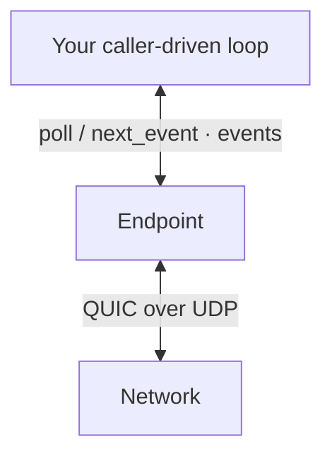

An `Endpoint` is the main application API. Five ideas explain most code built
on it.

## Endpoint

`Endpoint` owns an Ed25519 identity, a QUIC transport, and the synchronous
swarm driver. It is the app-facing entrypoint for listening, dialing, Ping,
Identify, and application streams.

An endpoint does not spawn a runtime. Your code makes progress by calling:

- `poll()` for one non-blocking driving step;
- `next_event(deadline)` to drive until an application event or deadline;
- a focused wait such as `wait_peer_ready` or `wait_path`.



:::note
Protocol and orchestration logic underneath `Endpoint` is Sans-I/O. The
library supplies sockets and clocks so application code can stay small, while
custom runtimes can use the deterministic lower layers directly.
:::

## PeerId

A `PeerId` identifies a node's authenticated public key. QUIC connections use
mutual libp2p TLS authentication, so connection events carry the verified
remote identity rather than a caller-supplied label.

`Endpoint::peer_id()` returns the local identity.

## PeerAddr and Multiaddr

A `Multiaddr` is a sequence of transport components:

```text
/ip4/127.0.0.1/udp/4001/quic-v1
```

A `PeerAddr` pairs that transport with a terminal peer identity:

```text
/ip4/127.0.0.1/udp/4001/quic-v1/p2p/12D3KooW…
```

Use `Multiaddr` when choosing where to bind. Use `PeerAddr` when dialing a
specific authenticated peer. See [Identity](/guides/identity) for circuit
addresses and wildcards.

## Connection readiness

`ConnectionEstablished` means QUIC is authenticated and established.
`PeerReady` comes later, after the first Identify exchange has supplied the
peer's supported protocols and advertised addresses.

Wait for `PeerReady` before opening an application stream. This avoids racing
protocol-support discovery.

## Dial versus connect

These are separate paths with different policy:

| Goal | Start with | Wait for |
| --- | --- | --- |
| Direct QUIC to a known address | `dial`, `dial_ip4`, or `dial_ip6` | `PeerReady` |
| NAT-aware attempt with optional relay | `connect`, `connect_addr`, or `connect_with_addrs` | `wait_path` or `NatEvent` |

The base `dial*` methods only start direct QUIC dials. They do not reserve on
a relay or perform DCUtR.

With the `nat` feature and an activated NAT driver, `connect*` can race direct
candidates against a relay leg. The first usable result is:

- `Path::DirectDialed` — a supplied direct address connected;
- `Path::DirectPunched` — DCUtR established a direct connection;
- `Path::Relayed { relay }` — an end-to-end protected circuit is usable.

A relayed path can later emit `NatEvent::PathUpgraded` when hole punching
lands.

:::warning
Compiling a Cargo feature only exposes its API. Activate the corresponding
driver on `EndpointBuilder`; see [Install](/quickstart/install#compiled-is-not-enabled).
:::

## Where events go

Ordinary connection, Identify, Ping, and application stream events come from
`poll` or `next_event`. Enabled feature drivers consume their own control
streams and expose focused queues:

- `take_nat_events` / `next_nat_event`;
- `take_pubsub_events` / `next_pubsub_event`;
- `take_discovery_events` / `next_discovery_event`.

Continue with [Listen and dial](/guides/listen-and-dial) or the
[glossary](/reference/glossary).
