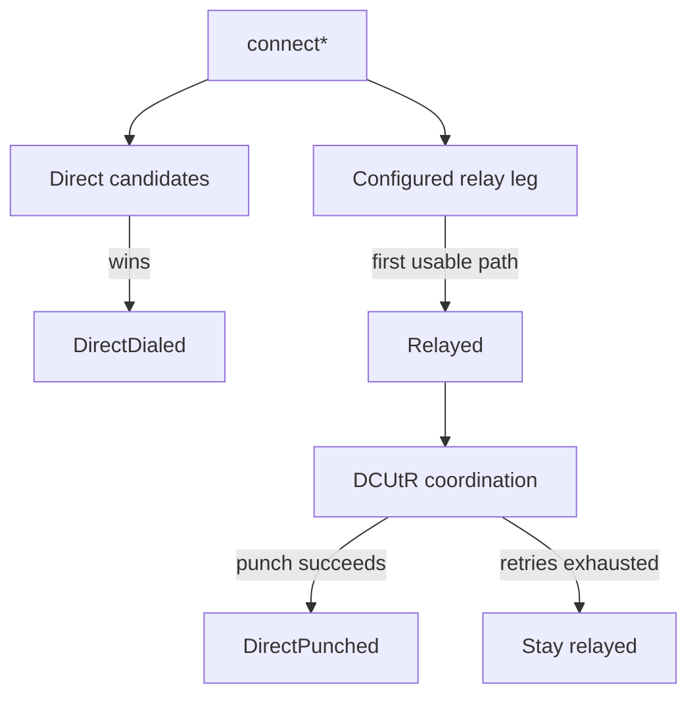

The `nat` feature adds an orchestrator that can race direct QUIC dials against
a Circuit Relay v2 path and attempt a DCUtR direct upgrade.

:::warning
minip2p ships relay client state machines and traversal policy. It does not
ship a production relay server. Bring a reachable Circuit Relay v2 server,
such as the
[rust-libp2p relay server example](https://github.com/libp2p/rust-libp2p/tree/master/examples/relay-server).
:::

## Compile and activate the driver

```toml
[dependencies]
minip2p = {
  git = "https://github.com/deepso7/minip2p",
  features = ["nat"]
}
```

Builder configuration determines what the active driver can do:

| Builder configuration | What it enables |
| --- | --- |
| `.relay(relay)` | Relay connects, reservations, and relay-assisted DCUtR |
| `.autonat_server(server)` | Reachability probes only, unless a relay is also configured |
| `.nat_config(config)` | NAT driver with explicit timeouts, retries, relays, probes, and reservation policy |
| `.discovery()` | NAT coordination as part of discovery, with whatever relay/probe infrastructure is also configured |

```rust
use minip2p::{Endpoint, PeerAddr};

let relay: PeerAddr = std::env::var("MINIP2P_RELAY")?.parse()?;
let mut node = Endpoint::builder()
    .relay(relay)
    .bind_quic_dual_stack()?;

node.listen_all()?;
```

Calling `.autonat_server(...)` alone creates a working reachability-probe
driver, but it does not create a relay leg. Configure a relay for relayed
connections, inbound reservations, and relay-assisted hole punching.

## Choose a connect method

| Known information | Method |
| --- | --- |
| Peer ID only; rely on configured relay | `connect(&peer_id)` |
| One direct `PeerAddr`, optionally raced against relays | `connect_addr(&peer_addr)` |
| Peer ID and several transport `Multiaddr` candidates | `connect_with_addrs(peer_id, addrs)` |

```rust
use std::time::Duration;

use minip2p::NatEvent;

let connect_id = node.connect_addr(&target)?;
match node.wait_path(connect_id, Duration::from_secs(60))? {
    Some(path) => println!("connected via {path:?}"),
    None => {
        let failed = node.take_nat_events().into_iter().find(|event| {
            matches!(
                event,
                NatEvent::ConnectFailed { connect_id: id, .. } if *id == connect_id
            )
        });
        match failed {
            Some(NatEvent::ConnectFailed { error, .. }) => {
                eprintln!("connect failed: {error:?}");
            }
            _ => eprintln!("no usable path before the deadline"),
        }
    }
}
```

`wait_path` returns `Ok(Some(path))` when it consumes the matching
`NatEvent::PathEstablished`. It returns `Ok(None)` in two cases:

- the attempt failed — `NatEvent::ConnectFailed` stays queued for
  `take_nat_events`;
- the deadline expired before either outcome — no `ConnectFailed` is
  synthesized.

## Path selection and upgrade



The first usable path is explicit:

- `Path::DirectDialed` — a direct candidate connected;
- `Path::DirectPunched` — a DCUtR hole punch connected;
- `Path::Relayed { relay }` — the protected relay circuit is usable.

When a relayed path upgrades later, the application receives
`NatEvent::PathUpgraded`. If punch windows fail, it receives
`HolePunchFailed` events and eventually `FellBackToRelay`; the relayed
connection stays usable.

## Reservations and reachability

A private listener needs a reservation before another peer can reach it
through the relay. Watch for:

```rust
for event in node.take_nat_events() {
    match event {
        minip2p::NatEvent::RelayReserved { relay, .. } => {
            println!("relay reservation ready: {relay}");
        }
        minip2p::NatEvent::ReachabilityChanged { new, .. } => {
            println!("reachability={new:?}");
        }
        _ => {}
    }
}
```

`node.reachability()` reports the current AutoNAT verdict.
`node.active_reservation()` returns the currently held reservation, if any.
AutoNAT servers are caller-supplied; minip2p does not discover them
automatically.

## Keep driving after the first path

`wait_path` returns when traffic can flow. Keep calling `next_event`, `poll`,
or feature-focused waits afterward so DCUtR, reservation renewal, and
connection events continue to progress.

For a complete live demonstration, use the existing
[`minip2p-peer` example](https://github.com/deepso7/minip2p/tree/main/examples/peer).
It shows loopback, relay reservations, relay fallback, and RTT changes after a
direct upgrade.
