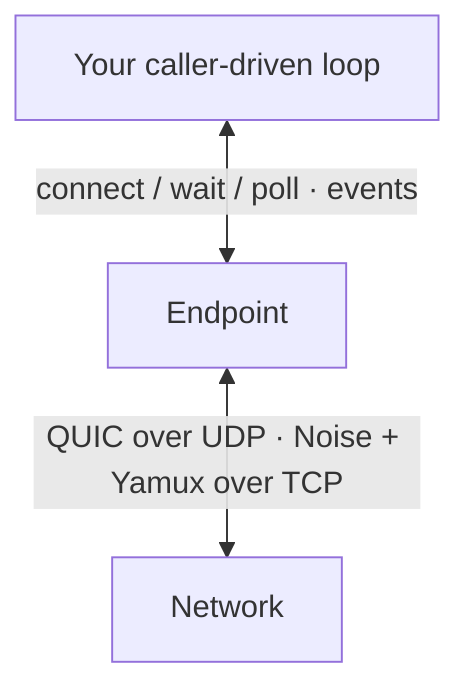

An `Endpoint` is the main application API. Five ideas explain most code built on it.

## Endpoint

`Endpoint` owns an Ed25519 identity, the transports you bound, and the connection state. It is the app-facing entrypoint for listening, connecting, Ping, Identify, and application streams. QUIC is on by default; add the `tcp` feature to use QUIC and TCP together, or listen only on TCP.

An endpoint does not spawn a runtime. `Endpoint::wait` is its one blocking wait over the ordered Endpoint event stream and returns an event, the deadline, or an interruption; it also delivers NAT, pubsub, discovery, and relay-server events. `poll()` is the non-blocking step for an existing reactor. Both use transport readiness when supported. Each call drives only its own endpoint, so blocking on one endpoint can delay others sharing the same thread.



<Callout type="note">

Protocol and orchestration logic underneath `Endpoint` is Sans-I/O. The library supplies sockets and clocks so application code can stay small, while custom runtimes can use the deterministic lower layers directly.

</Callout>

## PeerId

A `PeerId` identifies a node's authenticated public key. QUIC proves it with mutual libp2p TLS; TCP uses Noise XX, then Yamux. Either way, connection events carry the verified remote identity, not a label you passed in.

`Endpoint::peer_id()` returns the local identity.

## PeerAddr and Multiaddr

A `Multiaddr` is a sequence of transport components:

```text
/ip4/127.0.0.1/udp/4001/quic-v1
```

A `PeerAddr` pairs that transport with a terminal peer identity:

```text
/ip4/127.0.0.1/udp/4001/quic-v1/p2p/12D3KooW…
```

Use `Multiaddr` when choosing where to listen. Use `PeerAddr` when connecting to a specific authenticated peer. See [Identity](/rust/identity) for circuit addresses and wildcards.

## Connection readiness

`ConnectionEstablished` means the transport finished connecting and authenticated the peer. `PeerReady` comes later, after the first Identify exchange has supplied the peer's supported protocols and advertised addresses.

`open_stream` is allowed once the peer is connected. The remote-protocol advertisement check applies only after `PeerReady`; before that, negotiation proceeds without an early `RemoteDoesNotSupport` reject. Waiting for Identify is application policy when you want the advertised protocol list first, not a stack requirement for opening a known protocol.

## Connection attempts

`connect` starts one Connection attempt and returns its `ConnectId` immediately. The target is a `PeerId`, one complete `PeerAddr`, or a non-empty list of complete addresses naming the same peer. The attempt may run several Transport dials at once (one per candidate and IP family) and, with NAT traversal, a relay leg, but it ends with exactly one `EndpointEvent::ConnectSettled` carrying that ID: `Connected`, `Failed`, or `Cancelled`. `cancel_connect` is the only way to stop it; abandoning a wait never cancels.

Each address picks its transport (`/udp/…/quic-v1` or `/tcp`) and IP family (`/ip4`, `/ip6`, or `/dns*` resolution). Without NAT configuration, `connect` dials only direct candidates. With the `nat` capability enabled and a relay configured, it can race direct candidates against a relay leg. The first usable result is:

- `Path::DirectDialed`: a supplied direct address connected;
- `Path::DirectPunched`: DCUtR established a direct connection;
- `Path::Relayed { relay }`: an end-to-end protected circuit is usable.

A relayed path can later emit `NatEvent::PathUpgraded` when hole punching lands.

<Callout type="warning">

A Cargo feature makes a capability available. Enable it on `EndpointBuilder`; see [Install](/rust/install#add-an-optional-capability).

</Callout>

## Where events go

Every event leaves through the Endpoint event stream, read with `Endpoint::wait` or `poll`. One loop sees every event exactly once. Applications wait for a particular outcome by matching its ID (a `ConnectId`, `ConnectionId`, or `StreamId`) in that loop while dispatching everything else; see [Drive events](/rust/drive-events). Connection, Identify, Ping, and application stream events arrive as ordinary `EndpointEvent` variants. Enabled capabilities add variants to the same `#[non_exhaustive]` enum:

- `EndpointEvent::Nat(NatEvent)` (`nat`): path transitions, reachability, public addresses, and relay reservations. The attempt outcome is `ConnectSettled`, never a `NatEvent`;
- `EndpointEvent::Gossipsub(GossipsubEvent)` (`pubsub`);
- `EndpointEvent::Discovery(DiscoveryEvent)` (`discovery` / `mdns`);
- `EndpointEvent::RelayServer(RelayServerEvent)` (`relay-server`).

Durable state is available through State snapshot getters (`connected_peers`, `is_peer_ready`, `peer_info`, `connection_id`, `connection_remote_addr`, `bound_addresses`, and with capabilities `path`, `reachability`, `active_reservation`, `known_peers`). `bound_addresses` reports transport-bound local addresses and can be non-empty before `listen` starts accepting. Those getters do not drive the endpoint, are not one cross-getter atomic snapshot, and may be ahead of the event stream, never behind their own emitted transition.

Continue with [Listen and connect](/rust/listen-and-dial) or the [glossary](/reference/glossary).
