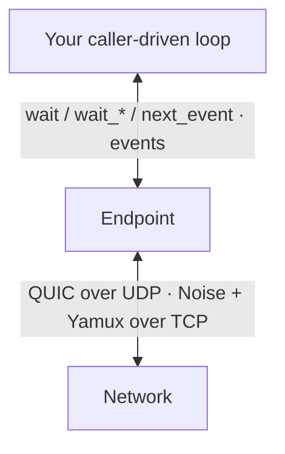

An `Endpoint` is the main application API. Five ideas explain most code built on it.

## Endpoint

`Endpoint` owns an Ed25519 identity, the transports you bound, and the connection state. It is the app-facing entrypoint for listening, dialing, Ping, Identify, and application streams. QUIC is on by default; add the `tcp` feature to use QUIC and TCP together, or bind only TCP.

An endpoint does not spawn a runtime. Prefer `Endpoint::wait` for the ordered Endpoint event stream (event, deadline, or interrupted); it also delivers NAT, pubsub, discovery, and relay-server events. Prefer `connect` plus `ConnectSettled` for a Connection attempt. Focused waits such as `nat_wait_path` and `wait_peer_ready`, plus `next_event`, remain during migration. All these methods use transport readiness when supported. Each call drives only its own endpoint, so blocking on one endpoint can delay others sharing the same thread. `poll()` is the non-blocking step for an existing reactor.



<Callout type="note">

Protocol and orchestration logic underneath `Endpoint` is Sans-I/O. The library supplies sockets and clocks so application code can stay small, while custom runtimes can use the deterministic lower layers directly.

</Callout>

## PeerId

A `PeerId` identifies a node's authenticated public key. QUIC proves it with mutual libp2p TLS; TCP uses Noise XX, then Yamux. Either way, connection events carry the verified remote identity, not a label you passed in.

`Endpoint::peer_id()` returns the local identity.

## PeerAddr and Multiaddr

A `Multiaddr` is a sequence of transport components:

```text
/ip4/127.0.0.1/udp/4001/quic-v1
```

A `PeerAddr` pairs that transport with a terminal peer identity:

```text
/ip4/127.0.0.1/udp/4001/quic-v1/p2p/12D3KooW…
```

Use `Multiaddr` when choosing where to bind. Use `PeerAddr` when dialing a specific authenticated peer. See [Identity](/rust/identity) for circuit addresses and wildcards.

## Connection readiness

`ConnectionEstablished` means the transport finished connecting and authenticated the peer. `PeerReady` comes later, after the first Identify exchange has supplied the peer's supported protocols and advertised addresses.

`open_stream` is allowed once the peer is connected. The remote-protocol advertisement check applies only after `PeerReady`; before that, negotiation proceeds without an early `RemoteDoesNotSupport` reject. Waiting for Identify is application policy when you want the advertised protocol list first, not a stack requirement for opening a known protocol.

## Dial versus connect

These are separate paths with different policy:

| Goal | Start with | Wait for |
| --- | --- | --- |
| Direct QUIC or TCP to a known address | `connect`, or `dial` / `dial_ip4` / `dial_ip6` | `ConnectSettled`, or connection then `wait_peer_ready` if you need Identify |
| NAT-aware attempt with optional relay | `connect` (peer, address, or address set) | `ConnectSettled`; `nat_wait_path` / `NatEvent` for the first usable path |

The base `dial*` methods only start direct dials. The address picks QUIC or TCP. They do not reserve on a relay or perform DCUtR.

With the `nat` capability enabled, `connect` can race direct candidates against a relay leg. The first usable result is:

- `Path::DirectDialed`: a supplied direct address connected;
- `Path::DirectPunched`: DCUtR established a direct connection;
- `Path::Relayed { relay }`: an end-to-end protected circuit is usable.

A relayed path can later emit `NatEvent::PathUpgraded` when hole punching lands.

<Callout type="warning">

A Cargo feature makes a capability available. Enable it on `EndpointBuilder`; see [Install](/rust/install#add-an-optional-capability).

</Callout>

## Where events go

Every event leaves through the Endpoint event stream: `Endpoint::wait`, `poll`, or the migration-era `next_event`. Prefer `wait` — it returns an event, deadline, or interruption without swallowing interrupts, and one `wait` loop sees every event exactly once. Connection, Identify, Ping, and application stream events arrive as ordinary `EndpointEvent` variants. Enabled capabilities add variants to the same `#[non_exhaustive]` enum:

- `EndpointEvent::Nat(NatEvent)` (`nat`): path transitions, reachability, public addresses, and relay reservations. The attempt outcome is `ConnectSettled`, never a `NatEvent`;
- `EndpointEvent::Gossipsub(GossipsubEvent)` (`pubsub`);
- `EndpointEvent::Discovery(DiscoveryEvent)` (`discovery` / `mdns`);
- `EndpointEvent::RelayServer(RelayServerEvent)` (`relay-server`).

The per-capability `take_*_events` / `next_*_event` methods remain as migration APIs until #181; they remove matching events from the same stream.

Durable state is available through State snapshot getters (`connected_peers`, `is_peer_ready`, `peer_info`, `connection_id`, `connection_remote_addr`, `bound_addresses`, and with capabilities `path`, `reachability`, `active_reservation`, `known_peers`). `bound_addresses` reports transport-bound local addresses and can be non-empty before `listen` starts accepting. Those getters do not drive the endpoint, are not one cross-getter atomic snapshot, and may be ahead of the event stream, never behind their own emitted transition.

Continue with [Listen and dial](/rust/listen-and-dial) or the [glossary](/reference/glossary).
