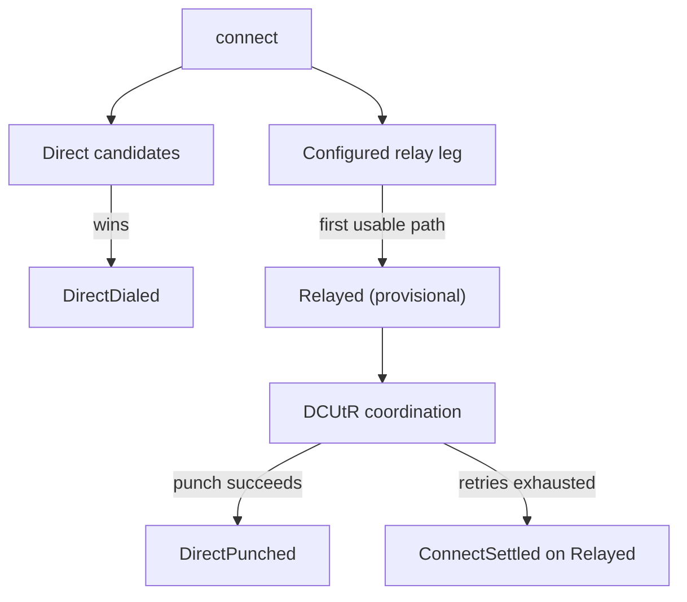

This guide starts where direct [listen and connect](/rust/listen-and-dial) leaves off. It configures relays and AutoNAT, races direct and relayed paths, and tracks later upgrades or fallback. Relayed paths require a reachable Circuit Relay v2 server, which minip2p can host.

<Badge>pre-1.0</Badge>

The `nat` feature adds an orchestrator that can race a direct QUIC or TCP dial against a Circuit Relay v2 path. DCUtR hole punching still needs QUIC.

## Host the relay

The independent std-only `relay-server` feature hosts Circuit Relay v2 over QUIC, TCP, or both. The bundled operator example uses both:

```bash
cargo run -p minip2p-relay-server-example -- \
  --key var/relay.ed25519 \
  --announce /dns4/relay.example.com/udp/19876/quic-v1 \
  --announce /dns4/relay.example.com/tcp/19876
```

Its default is the small `.relay_server().listen_on(..)?.bind()` application path. Optional flags expose frozen resource/rate/control limits, and stdin `pause`/`resume` changes only new admissions. Explicit addresses are trusted operator input; otherwise selection prefers AutoNAT-confirmed direct addresses and then concrete listeners. Address changes affect future Identify responses only. There is no automatic relay discovery: distribute the printed peer address to clients explicitly. See the [hosting guide](https://github.com/deepso7/minip2p/tree/main/examples/relay-server).

## Enable NAT traversal

```bash
cargo add minip2p-rs --features nat
```

Builder configuration determines the available behavior:

| Builder configuration | What it enables |
| --- | --- |
| `.relay(relay)` | Relay connects, reservations, and relay-assisted DCUtR |
| `.autonat_server(server)` | Reachability probes only, unless a relay is also configured |
| `.nat_config(config)` | Explicit timeouts, retries, relays, probes, and reservation policy |
| `.discovery()` | NAT coordination as part of discovery, with whatever relay/probe infrastructure is also configured |

```rust
use minip2p::{Endpoint, PeerAddr};

let relay: PeerAddr = std::env::var("MINIP2P_RELAY")?.parse()?;
let mut node = Endpoint::builder()
    .relay(relay)
    .listen_default()?
    .bind()?;

node.listen_all()?;
```

Calling `.autonat_server(...)` alone enables reachability probes, but it does not create a relay leg. Configure a relay for relayed connections, inbound reservations, and relay-assisted hole punching.

## Choose a connect method

`Endpoint::connect` is the one entry. Pass a peer ID, one `PeerAddr`, or a set of addresses that all name the same peer:

| Known information                                  | Call                  |
| -------------------------------------------------- | --------------------- |
| Peer ID; known addresses and/or a configured relay | `connect(&peer_id)`   |
| One complete `PeerAddr`                            | `connect(&peer_addr)` |
| Several complete `PeerAddr`s for the same peer     | `connect(addrs)`      |

A Peer-ID target with neither known addresses nor a relay settles `ConnectSettled { Failed(NoUsableRoute) }` through one terminal event. An empty or mixed-peer address list is refused synchronously with `ConnectTargetError`.

Wait for the Connect ID in your event loop:

```rust
use std::time::{Duration, Instant};

use minip2p::{ConnectOutcome, EndpointEvent, EndpointWaitOutcome, NatEvent, PeerAddr};

let target: PeerAddr =
    "/ip4/192.0.2.7/udp/4001/quic-v1/p2p/12D3KooWDpJ7As7BWAwRMfu1VU2WCqNjvq387JEYKDBj4kx6nXTN"
        .parse()?;
let connect_id = node.connect(&target)?;
let deadline = Instant::now() + Duration::from_secs(60);
loop {
    match node.wait(deadline)? {
        EndpointWaitOutcome::Event(EndpointEvent::Nat(NatEvent::PathEstablished {
            connect_id: id,
            path,
            ..
        })) if id == connect_id => println!("first usable path: {path:?}"),
        EndpointWaitOutcome::Event(EndpointEvent::ConnectSettled {
            connect_id: id,
            outcome,
            ..
        }) if id == connect_id => {
            match outcome {
                ConnectOutcome::Connected { .. } => println!("connected"),
                other => eprintln!("connect did not succeed: {other:?}"),
            }
            break;
        }
        EndpointWaitOutcome::Event(event) => println!("{event:?}"), // dispatch as usual
        EndpointWaitOutcome::Interrupted => {}
        EndpointWaitOutcome::Deadline => {
            // The deadline is local; stop the attempt explicitly.
            node.cancel_connect(connect_id);
            break;
        }
    }
}
```

`NatEvent::PathEstablished` reports the first usable path, which may be a provisional Relayed circuit. The attempt's terminal is `EndpointEvent::ConnectSettled` (connected after DCUtR settles, or immediately under `force_relay`). NAT attempt terminals (`ConnectFailed`, `FellBackToRelay`) are consumed by the Connection-attempt engine and never reach the stream; a failed attempt settles as `ConnectOutcome::Failed`.

`node.path(&peer)` is the State snapshot of the current path, independent of whether its event has been consumed yet.

## Path selection and upgrade



The first usable path is explicit:

- `Path::DirectDialed`: a direct candidate connected;
- `Path::DirectPunched`: a DCUtR hole punch connected;
- `Path::Relayed { relay }`: the protected relay circuit is usable.

That Relayed path is provisional until `ConnectSettled`. Applications that need the circuit immediately (echo, ping) can use it as soon as `path(peer)` is `Relayed`; the attempt is not finished until DCUtR settles or `force_relay` skips punching. When a relayed path upgrades later, the application receives `NatEvent::PathUpgraded`. If punch windows fail, it receives `HolePunchFailed` events and then `ConnectSettled` on the Relayed path; the relayed connection stays usable.

## Reservations and reachability

A private listener needs a reservation before another peer can reach it through the relay. Watch for:

```rust
use std::time::Duration;

use minip2p::{EndpointEvent, EndpointWaitOutcome, NatEvent};

loop {
    match node.wait(Duration::from_millis(250))? {
        EndpointWaitOutcome::Event(EndpointEvent::Nat(NatEvent::RelayReserved { relay, .. })) => {
            println!("relay reservation ready: {relay}");
        }
        EndpointWaitOutcome::Event(EndpointEvent::Nat(NatEvent::ReachabilityChanged { new, .. })) => {
            println!("reachability={new:?}");
        }
        EndpointWaitOutcome::Event(_) => {} // EndpointEvent is non-exhaustive
        EndpointWaitOutcome::Deadline | EndpointWaitOutcome::Interrupted => {}
    }
}
```

`node.reachability()` reports the current AutoNAT verdict. `node.active_reservation()` returns the currently held reservation, if any. These State snapshot getters may be ahead of the event stream, never behind their own emitted transition. AutoNAT servers are caller-supplied; minip2p does not discover them automatically.

## Keep driving after the first path

The first usable path means traffic can flow. Keep calling `wait` or `poll` afterward so DCUtR, reservation renewal, and connection events continue to progress. Each call drives only its own endpoint, so blocking on one endpoint can delay others sharing the same thread.

## Custom entropy without `std`

Most applications do not configure circuit entropy: `Endpoint` uses the operating system's random source by default. When embedding `minip2p-circuit` with default features disabled, provide an `EntropySource` that never substitutes predictable bytes on failure. See the [`minip2p-circuit` README](https://github.com/deepso7/minip2p/blob/main/crates/circuit/README.md) for the trait contract and a custom-source example.

For a complete live demonstration, use the existing [`minip2p-peer` example](https://github.com/deepso7/minip2p/tree/main/examples/peer). It shows loopback, relay reservations, relay fallback, and RTT changes after a direct upgrade.
